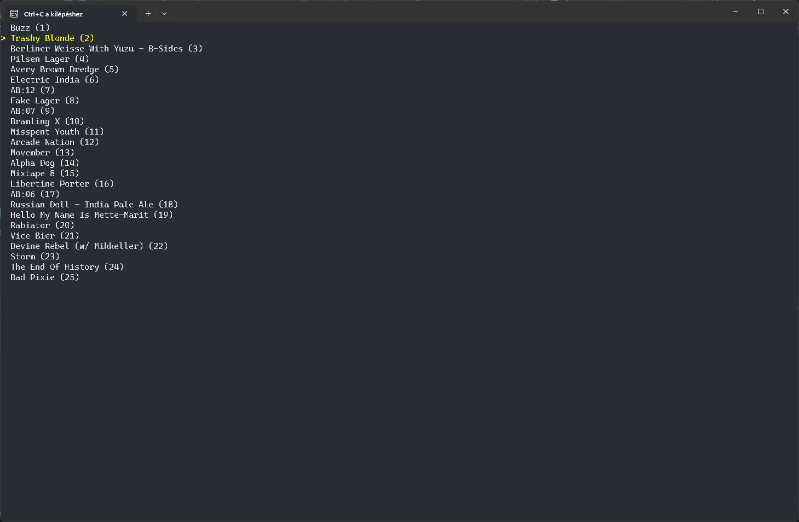
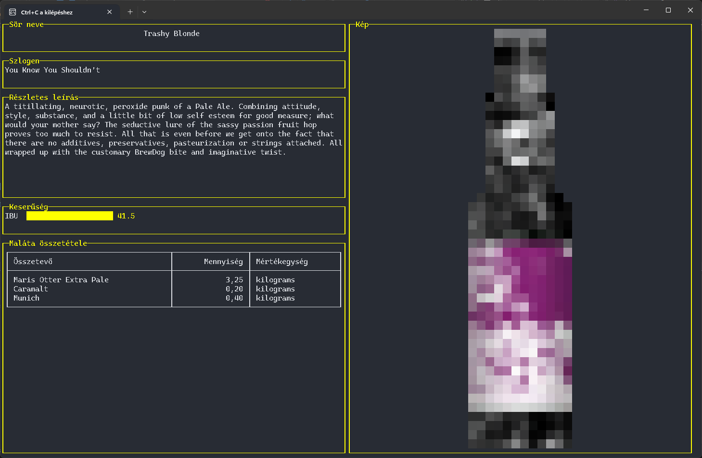

# SdaDms.Beers

Sörnyilvántartás navigáció konzol alkalmazás.

## C# környezet


### Beállítások

```
USAGE:
    SdaDms.Beers.dll [OPTIONS]

OPTIONS:
                        DEFAULT
    -h, --help                                              Prints help information
    -v, --version                                           Prints version information
    -s, --service       https://api.punkapi.com/v2/beers    Service URL
    -b, --background    default                             Background color
    -l, --langugage                                         UI langugae
```

### Működés

Kilépéshez használja a `Ctrl+C` billentyű kombinációt.

## Választás



## Áttekintés



## Go környezet


### Működés

Kilépéshez használja az `Esc` vagy a `Ctrl+C` billentyű kombinációt.

### Beállítások

```
Usage of ./beers:
  -b string
        The background color (shorthand)
  -background string
        The background color
  -l string
        UI langugage (shorthand) (default "en")
  -language string
        UI langugage (default "en")
  -u string
        The URL to fetch (sorthand) (default "https://api.punkapi.com/v2/beers")
  -url string
        The URL to fetch (default "https://api.punkapi.com/v2/beers")
```
